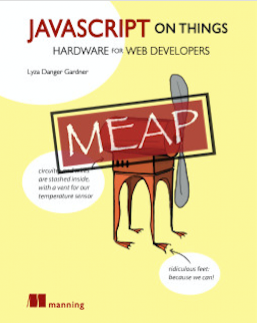
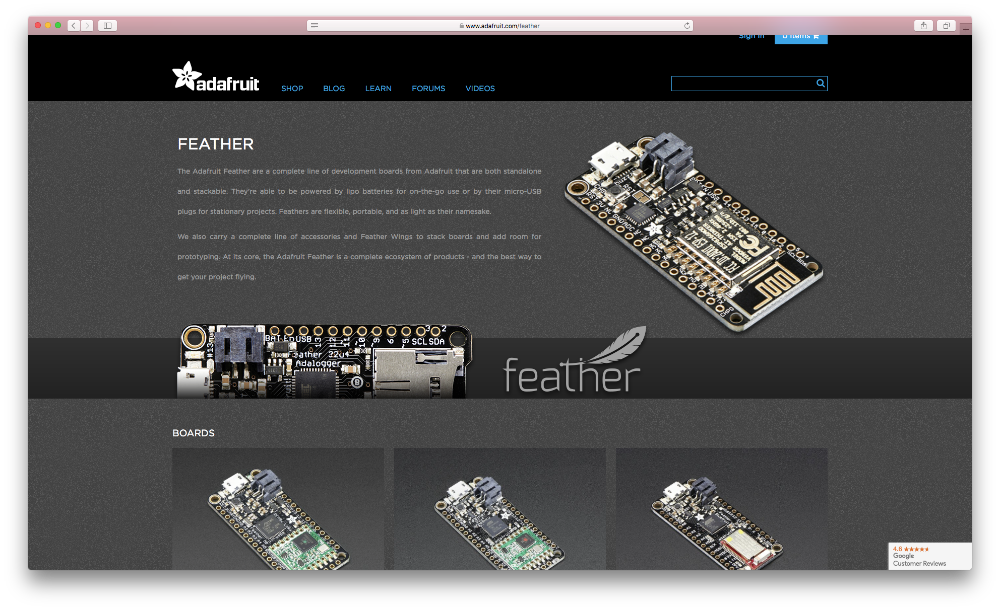
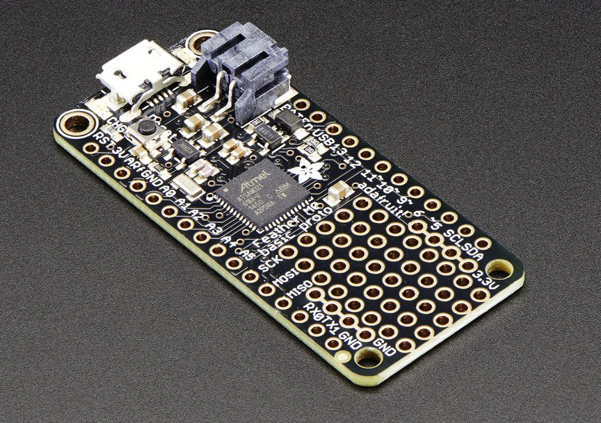
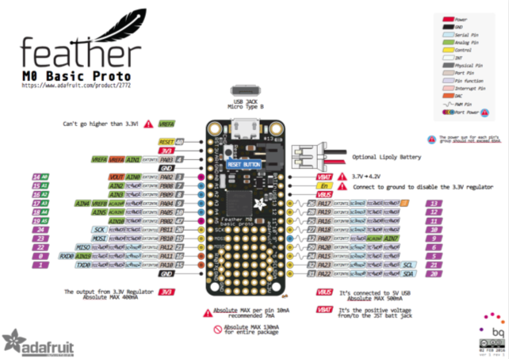

_As part and parcel of writing my book_ ([JavaScript on Things, Manning](https://www.manning.com/books/javascript-on-things) ) _and scratching the curiosity-itches of my hardware-hacking hobbies, I’ve had my hands on scads of different hardware platforms and components over the past year and more. This series of articles contain a collection of opinions and recommendations based on my experiences as they relate to two focus areas: electronics for beginners and JavaScript-controlled hardware._

This post’s electronics experience rating: INTERMEDIATE-PLUS

----

// TODO IMPORTANT link to previous post

In a previous post, I identified two standout development boards for beginners. In this one, I highlight a couple of boards that have surprised me by becoming some of my very favorites.

My introduction to Adafruit’s family of Feather boards wasn’t auspicious: while trying to cobble together a little network of LoRA radios (maybe I’ll talk about this more in-depth sometime as a case-study of Never, Ever, Ever Give Up; maybe it’s just too embarrassing), I feverishly ordered several Feathers from Adafruit, amazed that you could buy a tidily-packaged board with microcontroller and LoRA module for ONLY TWENTY DOLLARS.

_Image: Adafruit Feather dev boards on their website._

Actually, you can’t. Tripped up by similar product names, I ended up ordering [these boards with only the radio module on them](https://www.adafruit.com/product/3231), thinking they were [these $35 boards that actually have a freaking MCU on them, which is highly useful if you actually want to use the radio somehow](https://www.adafruit.com/product/3178).

During a protracted evening unboxing it dawned on me that the newly-arrived boards looked rather…minimal. I traveled several miles of self-hate that evening. By this point, the $35 ones with the MCU were sold the hell out, so I scrambled to find another Feather model that I could use to control the first set (it’s Feathers all the way down, ol’ chap).

This time: I ended up with some [32u4 Basic Proto](https://www.adafruit.com/product/2771) boards that I wanted to stack with the brainless LoRA Feathers.

Won over I was not. The (limited) [pin layout](https://learn.adafruit.com/assets/41528) seemed a tad cruel. What’s worse, only four pins have interrupt support and those pins are also the only pins that support TX, RX, SDA and SCL, a rather project-ending bummer when you’re building something that involves serial logging of I^2C sensor readings. Also awesome when I’d already soldered fly wires on the radio-only modules in a 32u4-specific fashion. Three cheers for desoldering wick and chagrin.

A few table-flips later I ultimately netted a small stack of the [Feather M0 Proto](https://www.adafruit.com/product/2772) boards. Now a few hundred bucks down the Feather rabbit hole, I was steeled for rueful-ironic laughter. And, yet. What is this? These boards fundamentally _do not suck_. In fact, they’re pretty great!

_Image: Adafruit Feather M0 Basic Proto. Source: Adafruit website._

## Feather Features I Like
There are some features common to many (if not all) Feathers that I didn’t get the joy of experiencing in my initial raging failfires but came to enjoy them once I had my M0s in hand.

I like the boards’ power options. You can plug ‘em into USB power, natch, but you can also attach a LiPo battery to the already-attached-and-waiting-for-yah JST connector and it _just works_. It’ll charge when on USB power, automatically prefer USB power when plugged in, then automatically switch over to LiPo power when disconnected. This is all kinds of convenient and awesome.

The consistency and commitment to the Feather form factor is handy if you want to stack or otherwise mix boards. There are a number of header arrangements you can choose between. I’d love to see a project that just keeps stacking Feathers on Feathers on Feathers…

Also, minor detail but one close to my heart: the pinout diagrams for the Feathers are clear and well-designed. Just lovely.

_Image: The M0 pinout diagram is clear and easy to read._ [Go see it full size](https://cdn-learn.adafruit.com/assets/assets/000/030/920/original/2772_pinout_v1_0.pdf?1457305622). _Credit: Adafruit._

## M0 Features I Like

I’m going to keep calling the Feather’s MCU the M0, because its actual naming flourishes surpass racehorses/members of the Hapsburg royal dynasty (feast on it: “Atmel® | SMART SAM D ARM® Cortex®-M0+ based microcontroller (MCU) “).

The M0 is a great little friend. Tons of pins, interrupts everywhere, PWM like it’s going out of style, and a not-too-hard-to-mess-with SERCOM for adding/munging serial interfaces (want all six serial modules to be SPI? You can probably do that). Quick compared to the ATmega32u4, with more Flash, more megahertzles, yet still low-power.

Coupled with the little Feather form factor it makes a pleasing platform. Not bad to work with to do Arduino-compatible stuff, once the finicky little bits of IDE/board support are done.

The only un-work-aroundable thing I ran into was a bug in the M0-specific Arduino Wire library (probably?) that made it [impossible to use these boards as I^2C slaves](https://forums.adafruit.com/viewtopic.php?f=24&t=111541) (as master, the more typical setup anyway, they’re fine). One day maybe I’ll go check on the status of that bug.

Anyway, I like this board. Which is funny because I had to go through much pain to find it.
