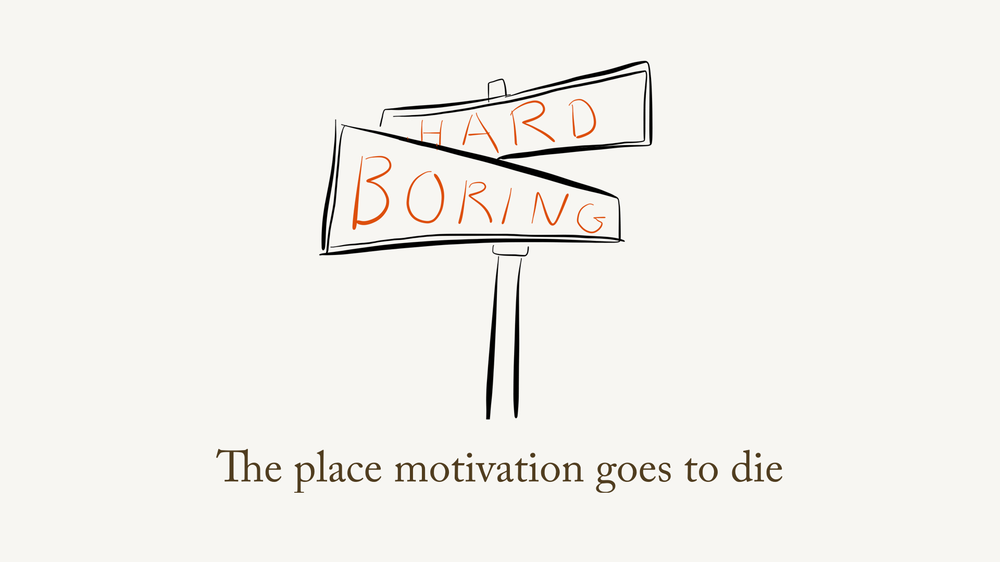
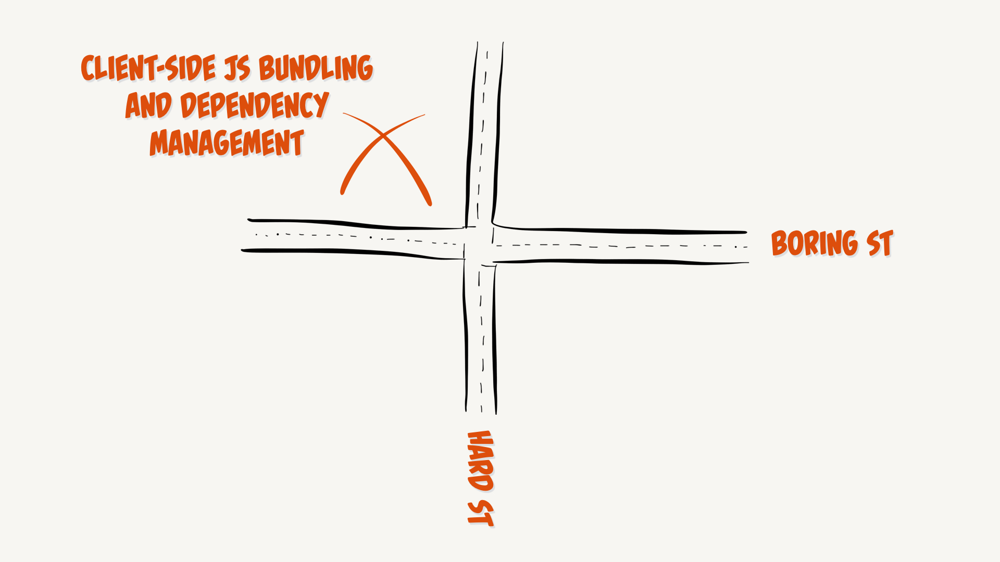
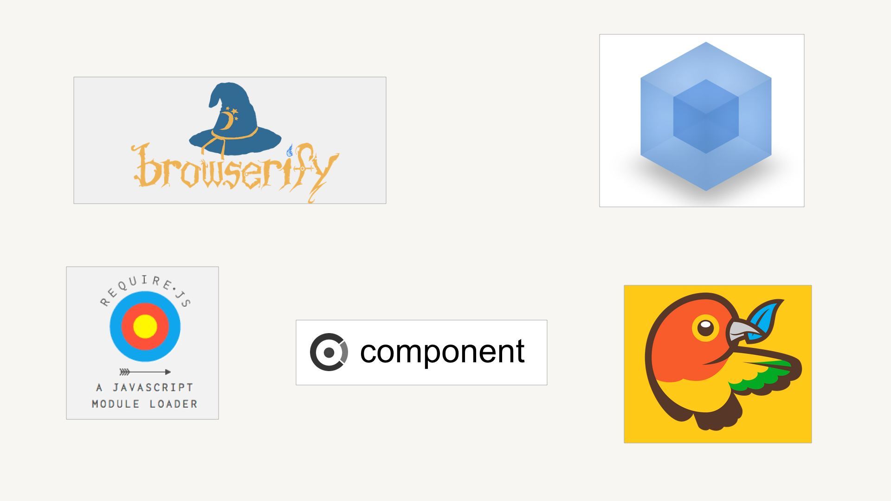

Months and seasons have technical themes, and one of mine right now is about JavaScript bundlers—that is, tools for packaging JavaScript for use in the client (you know: browser) and handling dependencies for us.

I have had some slides in some recent talks that are especially popular, as I mentioned in my [recent column on *A List Apart*](http://alistapart.com/column/the-tedium-of-managing-code) about this subject. And when I say *popular*, I mean, they spurred a raucous round of groaning and cheering. I imagine this sound rush:

<audio src="http://responsiveconf.com.s3.amazonaws.com/2015/audio/14-lyza-gardner-responsiveconf2015.mp3#t=597" controls><a href="https://huffduffer.com/adactio/243779">Listen to Responsive Day Out 3: Lyza Gardner</a></audio>

 marks that moment when a bunch of people in the audience realized: *Aha, it's not just hard for **me**. This is a shared suck.*

A number of times recently, I have thought, OK, this is the time. I'm going to sit down and spend a while delving into the problem set of managing dependencies and packaging code and understand the not just the differences between module schemes—which in large part I do, on a syntactic, get-it-done level—but the differences in philosophies and how we got to where we are, and with luck, maybe understand why where we got is so tedious and challenging.

### The problem is: I don't find it interesting

There are parts of this problem I find moderately *interesting*, but interesting in a momentary-eyebrow-raise way. Interesting in an academic sense. But the majority of it is, to me, boring. It's hard to want to dig in and figure something out that bores the socks off of me. As I say in my slides, one of the greatest technical demotivators is when something is difficult and dull at the same time:

That intersection, for me, is where this stuff ends up:

### And no offense to the tools

I'm not bashing the tools that do this work: they're essential and, often, sort of quietly amazing. But it just seems so *hard* sometimes (maybe I'm a whining, lazy developer?) and there are so many options out there, some of which are pieces of the same puzzle and some of which are mutually incompatible:

### I just feel so dumb

When I embarked on creating these talks and the *ALA* column, I thought my frustration with using these tools lay in their complexity and the dryness of what they accomplish. Getting this stuff right *is* often complex, and I still feel like the task isn't the most compelling, but I realized what actually *gets under my skin*.

This stuff makes me feel stupid.

When I spend a half an hour or more fighting a single transpiling error or a missing global, I start clenching and swearing. In my front-brain, I am angry for a weakness in a tool, a poorly-implemented wrapping node module, or the entire benighted ecosystem for its Byzantine smugness. That's why I *think* I'm mad.

But I now suspect I'm more angry because I feel like a fool. I want to get my head around this stuff, I want to subdue it, prevail. Even if it isn't *interesting*, the fact that it plays me for the fool puts me on a rampage. What's in my head is *Why the hell can't I figure this out? What the hell is wrong with me. I'm in the wrong industry.* What comes out of my mouth is: "Goddamit [browserify](http://browserify.org), why do you suck so hard?" Which of course it does not.

So, yeah, it's boring. But that *Kryptonite* part is relevant. That's what kills me.

### How about something constructive?

I've recognized my ire, so I hope that gives me a path to some sort of healing process. I can sip some herbal tea or something. But concretely, there are a few resources that popped up in the past week that are directly and objectively helpful.

* [Cloud Four](http://cloudfour.com) developer [Leander Harding](http://lsh.io) wrote a [devilishly clever post](http://blog.cloudfour.com/module_bunders_part_1/)—the first in a series—about what a *module* actually is in the purview of bundlers.
* I found [this post about JavaScript tooling in general](http://reactkungfu.com/2015/07/the-hitchhikers-guide-to-modern-javascript-tooling/) on [React Kung Fu](http://reactkungfu.com/) (it's not specific to React) to be a breath of fresh air. I like the way it stands back and clearly defines terms we may be more at sea about than we realize.
