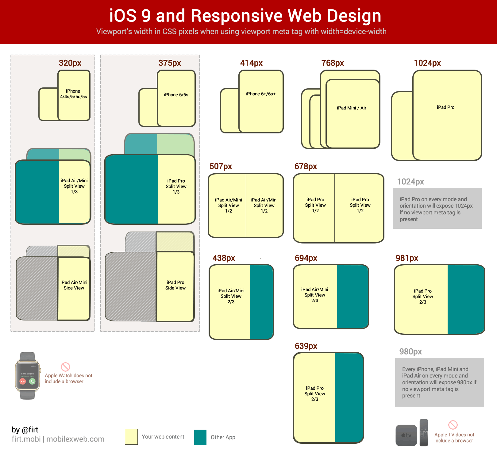

There's a lot of tasty meat to [Firt's post about iOS 9 Safari tech deets](http://www.mobilexweb.com/blog/ios9-safari-for-web-developers) and, correspondingly, there's been a lot of chatter around the intertubes today. Interesting stuff, from CSS scroll snapping to broader ES6 takeup. Kudos to Max for pulling all of this stuff together—so much info!

But aren't we all just a-quiver about the newly-unveiled "Split View" in Safari:

> On newer iPads, you can upgrade Side View to Split View where two apps share the screen working simultaneously.

There are a bunch of geometric flavors of this: 1/3 of the screen, 1/2, 2/3. This has major implications for responsive design!, people shout.

_Except it doesn't_, in my book.

There's been a voyeuristic flocking to [@firt's](https://twitter.com/firt) (_quite_ well-done) dimension porn image:

_(Thanks to @firt for permission to use this image from his [original post](http://www.mobilexweb.com/blog/ios9-safari-for-web-developers))_

And then we fall into a trap: _what media queries do I need to target all of those variants?_ _What are the pixel dimensions of each viewport possibility?_ _This changes everything! So much more work now!_

Let's reassess. Please.

This situation highlights the import of designing along a continuum, not along rigid particular breakpoints (with, what, windy, desolate, rocky, broken wilderness between them?). Let the content flow like water from a mobile- or content-first baseline design into the spaces of the viewport as it morphs. This sounds a little bit woo-woo, but I swear, in general, _it works_.

Thinking about proportions and shapes is fine. But when we try to canonize a set of specific pixel-based media queries (ever-expanding as viewport possibilities flourish) we're inadvertently committing ourselves to a kind of arms race that hearkens back to `User-Agent` sniffing.

I don't mean to understate the complexity of web design in our current device reality—yeah, it's challenging. But it doesn't have to be hard _in this way_. The number of adjustments I anticipate having to make to my site to make it look good in these new dimensions? Approximately zero. I've already tried to account for the continuum. (Disclaimer: I'm no designer. My version of "looks okay" across viewport sizes may not exactly be world-class.).

If there's any fragmentation here with respect to responsive web design, we're doing it to ourselves. Take a deep breath and let yourself free from the pixel bounds of each viewport out there...isn't that a little better?
