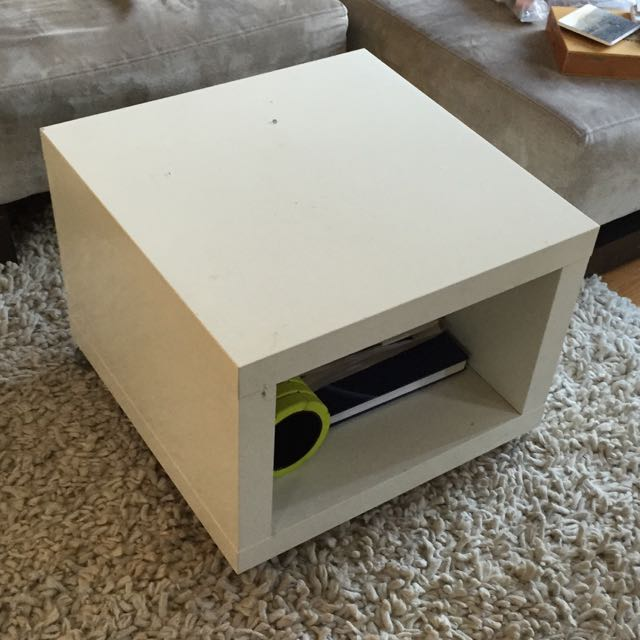

The past month has been blurry, due, in part, to some health fun I'll gloss over here. But before I'm off again (it's travel season), I wanted to jot down a few highlights.

## Tech

### Responsive Field Day: Cloud Four's first conference!

For [Cloud Four](http://www.cloudfour.com) staff, [Responsive Field Day](http://www.responsivefieldday.com) was a big ol' deal, one of the bigger things about our 2015 so far. Everything I have to say about the quality of the talks, the community feel of the event, and the contributions of Cloud Four-ians is so laudatory that it doesn't leave much else in my brain. Maybe that's part of being so close to the planning and execution of it. Maybe I can't see the proverbial forest for the trees. But, as well, all of the feedback I've received has been emphatically positive. So, I don't know. It seemed, just..._damned good_.

It was the first event Cloud Four has put on, and the first event for which I was deeply involved in planning. I enjoyed the hell out of it.

You can find videos and podcast-ed audio of everything from the day, talks and panels, on the [event's web site](http://www.responsivefieldday.com).

_Photo copyright 2015 [Win Goodbody](http://www.wingoodbody.photography/Event/20150925-Responsive-Field-Day/i-PzCzdDb)_

### Writings: On Service Workers and Progressive Enhancement

My [column this month](http://alistapart.com/column/how-do-we-get-it-done-now) for _A List Apart_ struck a nerve! On the good side, it's kicked up some good conversation about how to get things done to make offline-first a reality, _now_. For example, [David Walsh from Surge explains a tool for managinge App Cache more simply](http://davidwalsh.name/dont-wait-serviceworker-adding-offline-support-oneline).

The Web is complex and fun and I hope we keep making it the best we can.

## Non-tech

### On British village names...

A habit I've had since I was about ten is poring over maps the way someone else might read novels. I was in Wales a few years ago, whiling away a country evening flipping through a British driving atlas when I started to obsess over how wonderful British village names can be. I'm going to save diving into this until later, because it absolutely deserves its own post, but the esteemed Chris Higgins used an early spreadsheet I made of some of the choice finds to inspire a recent [article on Mental Floss](http://mentalfloss.com/article/69445/43-charmingly-odd-british-town-names).

### On the domestic front...

Here's proof that I can Pinterest with the rest of 'em. I got bored with the scraped-up crappy melamine top of the rolling coffee table in the living room (Ikea, and how).

#### Before

#### Then

Sanding, priming, and gold spray paint.

#### After

