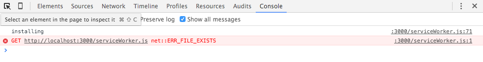
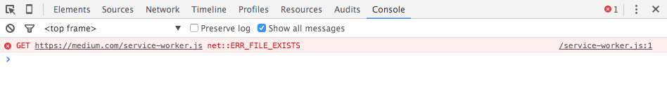
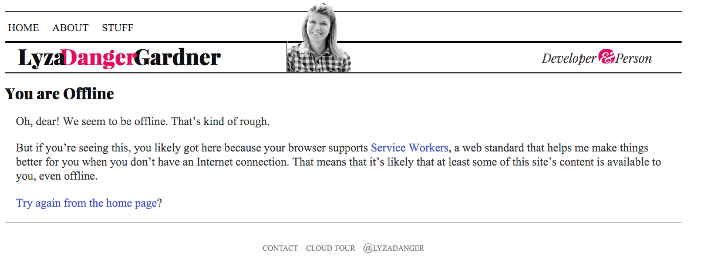
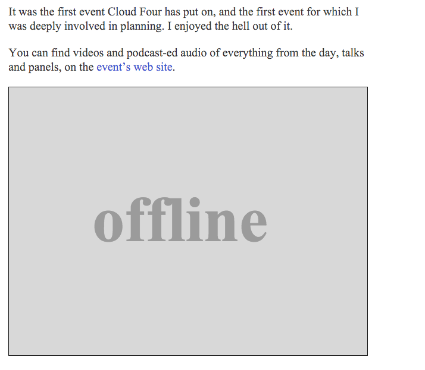
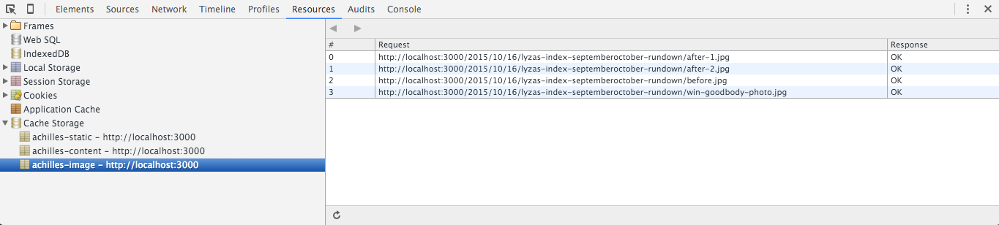
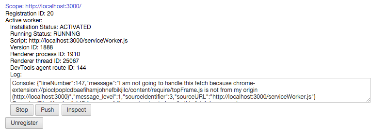

There's no shortage of boosterism and excitement about the fledgling [Service Worker API](https://www.w3.org/TR/service-workers/), now shipping in some popular browsers. There are cookbooks and blog posts, code snippets and tools. But I find that I when I want to learn a new web concept thoroughly, it can be ideal to dive in, roll up my proverbial sleeves, and build something from scratch. The bumps and bruises, gotchas and bugs I ran into have benefits: now _I_ understand service worker a lot better, and with any luck I can help _you_ avoid some of the headaches I encountered when working with the new API.

Service worker can do a lot of different things; there are myriad ways to harness its powers. I decided to build a simple service worker for my (static, uncomplicated) site that _roughly_ mirrored the features that the obsolete Application Cache API used to provide—that is:

* makes the site function offline
* increases online performance by reducing network requests for certain assets
* provides a customized offline fallback experience

Inspired by [Jeremy Keith's post](https://adactio.com/journal/9888) describing his recent successes building a service worker for his site, I decided to build on his solution and create my own. There are so very many ways to skin a cat. This is mine.

Before I begin, I should point out that I'm _hugely_ in debt to Jeremy for the source of this work, and almost wouldn't write about it save for an exhortation in [his post](https://adactio.com/journal/9775):

> So if you decide to play around with Service Workers, please, please share your experience.

My marching orders are set!

## What is service worker, anyway?

A service worker is a script that stands between your web site and the network, giving you, among other things, the ability to intercept network requests and respond to them in different ways.

For your site or app to work, the browser fetches its assets—e.g. HTML pages, JavaScript, images, fonts. In the past, the management of this was chiefly the browser's prerogative. If the browser couldn't access the network, you would probably see its "Hey, you're offline" interface. There were techniques you could use to encourage the local caching of assets, but the browser often had the last say.

This wasn't such a great experience for users who were offline, and it left web developers with little control over browser caching.

Cue Application Cache, whose arrival several years ago seemed promising. It ostensibly let you dictate how different assets should be handled so that your site or app could work offline. Yet AppCache's simple-looking syntax belied its [underlying confounding nature and lack of flexibility](http://alistapart.com/article/application-cache-is-a-douchebag).

The fledgling service worker API can do what Application Cache did, and also a whole lot more. But service worker at first looks a little daunting. The specs can be heavy and abstract reading, and there are numerous APIs that are subservient to it or otherwise related: `cache`, `fetch`, etc. Service workers encompass so much functionality: push notifications, and, soon, background synching. Compared to Application Cache it looks...complicated.

Whereas Application Cache (which, by the way, is [going away](https://html.spec.whatwg.org/multipage/browsers.html#offline)) was easy to learn but terrible for every single moment after that (my opinion), service worker is more of an initial cognitive investment, but it is powerful and useful and you can generally get yourself out of trouble if you break things.

--------

## Some basic service worker concepts

A service worker is a file with some JavaScript in it. Inside of that file you can write JavaScript as you know and love it, with a few important things to keep in mind.

Service worker scripts run in a separate thread in the browser from the pages they control. There are ways to communicate between workers and pages, but they execute in a separate [scope](https://developer.mozilla.org/en-US/docs/Web/API/ServiceWorkerGlobalScope). That means you won't have access to the DOM of those pages, for example. I visualize a service worker as sort of running in a separate tab from the page it affects; this is not at all _accurate_ but it is a helpful rough metaphor for keeping myself out of confusion.

JavaScript in a service worker must not block. You need to use asynchronous APIs. For example, you cannot use `localStorage` inside a service worker (`localStorage` is a synchronous API). Humorously enough, even knowing this I managed to run the risk of violating it, as we'll see.

### Registering a service worker

You make a service worker take effect by **registering** it. This registration is done from outside the service worker, by another page or script on your site. On my site, there is a global `site.js` script included in every HTML page. I register my service worker from there.

When you register a service worker, you (optionally) also tell it what **scope** it should apply itself to. You can instruct a service worker only to handle stuff for part of your site, e.g. `'/blog/'`, or you can register it for your whole site (`'/'`) like I do.

### Service worker lifecycle and events

A service worker does the bulk of its work by **listening for relevant events and responding to them in useful ways**. Different events are triggered at different points in a service worker's **lifecycle**.

#### Install

Once the service worker has been registered and downloaded, it gets _installed_ in the background. Your service worker can listen for the **install event** and perform tasks appropriate for this stage.

In our case, we want to take advantage of the install state to pre-cache a bunch of assets we know we want available offline later.

#### Activate

After the `install` stage is finished, the service worker is then _activated_. That means the service worker is now in control of things within its `scope` and can do its thing. The **activate event** isn't too exciting for a new service worker, but we'll see how it's useful when updating a service worker with a new version.

Exactly when _activation_ occurs depends on whether this is a brand-new service worker or an updated version of a pre-existing service worker. If the browser does not have a previous version of a given service worker already registered,
_activation_ will happen immediately after _installation_ is complete.

Once _installation_ and _activation_ are complete, they won't occur again until an updated version of the service worker is downloaded and registered.

#### Other events

Beyond _install_ and _activate_, we'll be looking primarily at the _fetch_ event today to make our service worker useful. But there are several useful events beyond that: _sync_ events and _notification_ events, for example.

For extra credit or leisure fun, you can [read more about the interfaces that service worker implements](https://developer.mozilla.org/en-US/docs/Web/API/Service_Worker_API#Interfaces). It's by implementing these interfaces that service worker gets the bulk of its events and much of its extended functionality.

### Service worker's Promise-based API

The service worker API makes heavy use of `Promises`. A `Promise` represents the eventual result of an asynchronous operation, even if the actual value won't be known until the operation completes some time in the future.

```
getAnAnswerToADifficultQuestionSomewhereFarAway()
  .then(answer => {
    console.log(`I got the ${answer}!`);
  })
  .catch(reason => {
    console.log(`I tried to figure it out but couldn't because ${reason}`);
  });
```

The `getAnAnswer...` function returns a `Promise` that (we hope) will eventually be _fulfilled_ by, or _resolve_ to, the `answer` we're looking for. Then that `answer` can be fed to any chained `then` handler functions, or, in the sorry case of failure to achieve its objective, the `Promise` can be _rejected_—often with a _reason_—and `catch` handler functions can take care of these situations.

There's more to `Promises`, but I'll try to keep the examples here straightforward (or at least commented). I urge you to do some [informative reading](https://developer.mozilla.org/en-US/docs/Mozilla/JavaScript_code_modules/Promise.jsm/Promise) if you're still new to Promises.

**Note**: I use certain ES6/ES2015 features in the example code for service workers because browsers that support service workers also support these features. Specifically here I am using [arrow functions](https://developer.mozilla.org/en-US/docs/Web/JavaScript/Reference/Functions/Arrow_functions) and [template strings](https://developer.mozilla.org/en-US/docs/Web/JavaScript/Reference/template_strings).

### Other service worker necessities

It's also important to note that service workers **require HTTPS** to work. There is an important and useful exception to this rule: service workers work for `localhost` on insecure `http`, which is a relief because setting up local SSL can sometimes be a slog.

Fun fact: this project forced me to do something I'd been putting off for a while—getting and configuring SSL for the `www` subdomain of my site. This is something I urge folks to consider doing because pretty much all of the fun new stuff hitting the browser in the future is going to require SSL to use it.

@TODO Browser compatibility

--------------

## Registering, installing and activating a service worker

Now that we've taken care of some theory, we can start putting together our service worker.

To install and activate our service worker, we want to listen for `install` and `activate` events and act on them.

We can start with an empty file for our service worker and add a couple of `eventListeners`. In `serviceWorker.js`:

```
self.addEventListener('install', event => {
  // Do install stuff
});

self.addEventListener('activate', event => {
  // Do activate stuff: this will come later on
});
```

### Registering our service worker

Now we need to tell the pages on our site to _use_ the service worker.

Remember, this registration happens from outside the service worker—in my case, from within a script (`/js/site.js`) that is included on every page of my site.

In my `site.js`:

```
if ('serviceWorker' in navigator) {
  navigator.serviceWorker.register('/serviceWorker.js', {
    scope: '/'
  });
}
```

### Pre-caching static assets during install

I want to use the _install_ stage to pre-cache some assets on my site:

* By pre-caching some static assets (images, CSS, JS) that are used by many pages on my site, I can speed up load times by grabbing these out of cache instead of fetching from the network on subsequent page loads.
* By pre-caching an offline fallback page, I can show a nice page when I can't fulfill a page request because the user is offline.

The steps to do this are:

1. Tell the `install` event to hang on and not complete until I've done what I need to do by using `event.waitUntil`.
2. Open the appropriate `cache` and stick the static assets inside of it by using `Cache.addAll`. In [progressive web app](https://developers.google.com/web/progressive-web-apps?hl=en) parlance, these assets make up my _application shell_.

In `/serviceWorker.js`, expanding the `install` handler:

```
self.addEventListener('install', event => {

  function onInstall () {
    return caches.open('static')
      .then(cache =>
        cache.addAll([
          '/images/lyza.gif',
          '/js/site.js',
          '/css/styles.css',
          '/offline/',
          '/'
        ])
      );
  }

  event.waitUntil(onInstall(event));
});
```

Service worker implements the [`CacheStorage` interface](https://developer.mozilla.org/en-US/docs/Web/API/CacheStorage), which makes the `caches` property available globally in our service worker. There are several useful methods on `caches`, for example `open` and `delete`.

You can see `Promises` at work here: `caches.open` returns a `Promise` resolving to a [`cache`](https://developer.mozilla.org/en-US/docs/Web/API/Cache) object once it has successfully opened the `static` cache; `addAll` also returns a `Promise` that resolves when all of the items passed to it have been stashed in the cache.

I tell the `event` to wait until the `Promise` returned by my handler function is resolved successfully. Then we can be sure all of those pre-cache items get sorted before the _installation_ is complete.

#### console confusions

##### Stale logging

_Possibly_ not a bug, but certainly a confusion: if you `console.log` from service workers, Chrome will continue to re-display (not clear) those log message in subsequent page requests. This can make it _seem_ like events are firing too many times or code is executing over and over. [Chromium issue here](https://code.google.com/p/chromium/issues/detail?id=543104&q=service%20worker%20event&colspec=ID%20Pri%20M%20Stars%20ReleaseBlock%20Cr%20Status%20Owner%20Summary%20OS%20Modified#makechanges).

For example, if we add a log statement to our install handler:

```
self.addEventListener('install', event => {
  // ... as before
  console.log('installing');
});

```

<a href="stale-logging.png"></a>

_Figure: As of Chrome 47, the 'installing' log message will continue to appear on subsequent page requests. Chrome isn't really firing the 'install' event on every page load. Instead, it's showing stale logs._

##### An error when things are OK

Another odd thing is that once a service worker is installed and activated, subsequent page loads for any page within its scope will always cause a single error in the console. I thought I was doing something wrong.

<a href="console-error.png"></a>

_Figure: As of Chrome 47, accessing a page with an already-registered service worker will **always** cause this error in the console._

### What we've accomplished so far

The service worker handles the `install` event and pre-caches some static assets. If you were to use this service worker and register it, it would indeed pre-cache the indicated assets, but wouldn't yet be able to take advantage of them offline.

You can [see the contents of serviceWorker.js here](https://github.com/lyzadanger/serviceworker-example/blob/master/01-install-precache/serviceWorker.js).


------------------

## Fetch handling with service workers

So far our service worker has a fleshed-out `install` handler, but doesn't _do_ anything beyond that. The magic of our service worker is really going to happen when **fetch events** are triggered.

We can _respond to_ fetches in different ways. By using different **network strategies**, we can tell the browser to always try to fetch certain assets from the network (making sure key content is fresh) while favoring cached copies for static assets—really slimming down our page payloads. We can also provide a nice offline fallback if all else fails.

Whenever a browser wants to _fetch_ an asset that is within the _scope_ of this service worker, we can hear about it by, yep, adding an `eventListener` in `serviceWorker.js`:

```
self.addEventListener('fetch', event => {
  // ... Perhaps respond to this fetch in a useful way?
});
```

Again, _every_ fetch that falls within this service worker's scope (i.e. path) will trigger this event—HTML pages, scripts, images, CSS, you name it. We can selectively handle the way the browser responds to any of those fetches.

### Should we handle this fetch?

When a `fetch` event occurs for an asset, the first thing I want to determine is whether this service worker should interfere with the fetching of the given resource. Otherwise, it should do nothing and let the browser assert its default behavior.

We'll end up with basic logic like this in `serviceWorker.js`:

```
self.addEventListener('fetch', event => {

  function shouldHandleFetch (event, opts) {
    // Should we handle this fetch?
  }

  function onFetch (event, opts) {
    // ... TBD: respond to the fetch
  }

  if (shouldHandleFetch(event, config)) {
    onFetch(event, config);
  }
});
```

The `shouldHandleFetch` function assesses a given request to determine whether we should provide a response or let the browser assert its default handling.

#### Why not use Promises?

To keep with service worker's predilection for Promises, the first version of my `fetch` event handler looked like this:

```
self.addEventListener('fetch', event => {

  function shouldHandleFetch (event, opts) { }
  function onFetch (event, opts) { }

  shouldHandleFetch(event, config)
    .then(onFetch(event, config))
    .catch(...);
});
```

Seems logical, but I was making a couple of rookie mistakes with Promises. I swear I did sense a code smell even initially, but it was Jake who set me straight on the errors of my ways. (Lesson: as always, if code feels wrong, it probably is).

Promise rejections should not be used to indicate "I got an answer I didn't like", instead, rejections should indicate "ah, crap, something went wrong and I couldn't get an answer at all." Plus, there's nothing asynchronous about what the `shouldHandleFetch` function is doing, so it's not an appropriate fit for Promises.

The fact that I needed to handle a `catch` there should have been a red flag for me.

#### Criteria for valid requests

My site-specific criteria are as follows:

1. The requested URL should represent something I want to cache or respond to. Its path should match a `Regular Expression` of valid paths.
2. The request's HTTP method should be `GET`.
3. The request should be for a resource from my origin (`lyza.com`).

If any of the `criteria` tests evaluate to `false`, we should _not_ handle this request. In `serviceWorker.js`:

```
function shouldHandleFetch (event, opts) {
  var request            = event.request;
  var url                = new URL(request.url);
  var criteria           = {
    matchesPathPattern: !!(opts.cachePathPattern.exec(url.pathname),
    isGETRequest      : request.method === 'GET',
    isFromMyOrigin    : url.origin === self.location.origin
  };

  // Create a new array with just the keys from criteria that have
  // failing (i.e. false) values
  var failingCriteria    = Object.keys(criteria)
    .filter(criteriaKey => !criteria[criteriaKey]);

  // If that failing Array has any length, one or more tests failed
  return !failingCriteria.length;
}

```

Of course, the criteria here are my own and would vary from site to site. `event.request` is a [`Request`](https://developer.mozilla.org/en-US/docs/Web/API/Request) object that has all kinds of data you can look at to assess how you'd like your fetch handler to behave.

*Trivial note:* If you noticed the incursion of `config`, passed as `opts` to handler functions, well-spotted. I factored out some reusable config-like values and created a `config` object in the top-level scope of the service worker:

```
var config = {
  staticCacheItems: [
    '/images/lyza.gif',
    '/css/styles.css',
    '/js/site.js',
    '/offline/',
    '/'
  ],
  cachePathPattern: /^\/(?:(20[0-9]{2}|about|blog|css|images|js)\/(.+)?)?$/
};
```

##### Why whitelist?

You may be wondering why I'm only caching things with paths that match this regular expression:

`/^\/(?:(20[0-9]{2}|about|blog|css|images|js)\/(.+)?)?$/`

instead of caching anything coming from my own origin.

A couple of reasons:

* I don't want to cache the service worker itself;
* When I'm developing my site locally, there are some requests generated for things I don't want to cache. For example, I use `browserSync` which kicks off a bunch of related requests in my development environment. I don't want to cache that stuff! It seemed messy and challenging to try to think of everything I _wouldn't_ want to cache (not to mention a little weird to have to spell it out in my service worker's configuration), so a whitelist approach seemed more natural.

### Writing the fetch handler

Now we're ready to pass applicable `fetch` requests on to a handler. The `onFetch` function needs to determine:

1. What kind of resource is being requested?
2. How should I fulfill this request?

#### 1. What kind of resource is being requested?

I can look at the `HTTP Accept` header to get a hint as to what kind of asset is being requested. This helps me figure out how I want to handle it.

```
function onFetch (event, opts) {
  var request      = event.request;
  var acceptHeader = request.headers.get('Accept');
  var resourceType = 'static';
  var cacheKey;

  if (acceptHeader.indexOf('text/html') !== -1) {
    resourceType = 'content';
  } else if (acceptHeader.indexOf('image') !== -1) {
    resourceType = 'image';
  }

  // {String} [static|image|content]
  cacheKey = resourceType;
  // ... now do something
}
```

For organization, I want to stick different kinds of resources into different caches. That allows me to manage those caches later. These cache key `String`s are arbitrary—you can call your caches whatever you like; the cache API doesn't have opinions.

#### 2. Respond to the fetch

The next thing for `onFetch` to do is to `respondTo` the `fetch` event with an intelligent `Response`.

```
function onFetch (event, opts) {
  // 1. Determine what kind of asset this is...(above)
  if (resourceType === 'content') {
    // Use a network-first strategy
    event.respondWith(
      fetch(request)
          .then(response => addToCache(cacheKey, request, response))
        .catch(() => fetchFromCache(event))
        .catch(() => offlineResponse(opts))
    );
  } else {
    // Use a cache-first strategy
    event.respondWith(
      fetchFromCache(event)
        .catch(() => fetch(request))
          .then(response => addToCache(cacheKey, request, response))
        .catch(() => offlineResponse(resourceType, opts))
    );
  }
}
```

#### Careful with Async!

In our case, `shouldHandleFetch` doesn't do anything async, and neither does `onFetch` up to the point of `event.respondWith`. If something async _had_ happened before that, we would be in trouble. `event.respondWith` must be called between the `fetch` event firing and control returning to the browser. Same thing goes for `event.waitUntil`. Basically, if you're handling an event, either do something immediately (synchronously) or tell the browser to hang on until your async stuff is done.

### HTML content: implementing a network-first strategy

Responding to fetch requests involves implementing an appropriate network strategy. Let's look more closely at the way we're responding to requests for HTML content (`resourceType === 'content'`).

```
if (resourceType === 'content') {
  // Respond with a network-first strategy
  event.respondWith(
    fetch(request)
        .then(response => addToCache(cacheKey, request, response))
      .catch(() => fetchFromCache(event))
      .catch(() => offlineResponse(opts))
  );
}
```

The way we fulfill requests for content here is a **network-first strategy**. Because HTML content is the core concern of my site and it changes often, always try to get fresh HTML documents from the network.

Let's step through this:

#### 1. Try fetching from the network

```
fetch(request)
   .then(response => addToCache(cacheKey, request, response))
```

If the network request is successful (the Promise resolves), go ahead and stash a copy of the HTML document in the appropriate cache (`content`). This is called **read-through caching**:

```
function addToCache (cacheKey, request, response) {
  if (response.ok) {
    var copy = response.clone();
    caches.open(cacheKey).then( cache => {
      cache.put(request, copy);
    });
    return response;
  }
}
```

##### Responses can only be used once

We need to do two things with the `response` we have:

* cache it
* respond to the event with it (i.e. return it)

But `Response` objects can only be used once. By cloning it:

`var copy = response.clone();`

we get around this limitation.

##### Don't cache bad responses

Don't make the same mistake I did. The first version of my code didn't have this conditional:

`if (response.ok)`

Pretty awesome to end up with 404 or other bad responses in the cache! Only cache happy responses.

#### 2. Try to retrieve from cache

If retrieving the asset from the network succeeds, we're done, however, if it doesn't, we might be offline or otherwise network-compromised. Try retrieving a previously-cached copy of the HTML from cache:

```
fetch(request)
  .then(response => addToCache(cacheKey, request, response))
  .catch(() => fetchFromCache(event))
```

Here is the `fetchFromCache` function:

```
function fetchFromCache (event) {
  return caches.match(event.request).then(response => {
    if (!response) {
      // A synchronous error that will kick off the catch handler
      throw Error(`${event.request.url} not found in cache`);
    }
    return response;
  });
}
```

*Note*: You don't indicate which cache you wish to check with `caches.match`; you check all of 'em at once.

#### 3. Provide an offline fallback

If we've made it this far, but there's nothing in the cache we can respond with, return an appropriate offline fallback, if possible. For HTML pages, this is the page cached from `/offline/`. It's a reasonably well-formatted page that lets the user know they're offline and I can't fulfill what they're after.

```
fetch(request)
  .then(response => addToCache(cacheKey, request, response))
  .catch(() => fetchFromCache(event))
    .catch(() => offlineResponse(opts))
```

And here is the `offlineResponse` function:

```
function offlineResponse (resourceType, opts) {
  if (resourceType === 'image') {
    // ... return an offline image
  } else if (resourceType === 'content') {
    return caches.match('/offline/');
  }
  return undefined;
}
```

<a href="offline-page.png"></a>

_Figure: An offline page_

### Other resources: implementing a cache-first strategy

The fetch logic for resources other than HTML content use a **cache-first strategy**. Images and other static content on the site rarely change, so check the cache first and avoid the network round-trip.

```
event.respondWith(
  fetchFromCache(event)
    .catch(() => fetch(request))
      .then(response => addToCache(cacheKey, request, response))
    .catch(() => offlineResponse(resourceType, opts))
);
```

The steps here are:

1. Try to retrieve the asset from cache;
2. If that fails, try retrieving from network (with read-through caching);
3. If that fails, provide a offline fallback resource if possible.


#### Offline image

We can return an SVG image with the text "Offline" as an offline fallback by completing the `offlineResource` function:

```
function offlineResponse (resourceType, opts) {
  if (resourceType === 'image') {
    return new Response(opts.offlineImage,
      { headers: { 'Content-Type': 'image/svg+xml' } }
    );
  } else if (resourceType === 'content') {
    return caches.match(opts.offlinePage);
  }
  return undefined;
}
```

And relevant updates to `config` :

```
var config = {
  // ...
  offlineImage: '<svg role="img" aria-labelledby="offline-title"'
    + ' viewBox="0 0 400 300" xmlns="http://www.w3.org/2000/svg">'
    + '<title id="offline-title">Offline</title>'
    + '<g fill="none" fill-rule="evenodd"><path fill="#D8D8D8" d="M0 0h400v300H0z"/>'
    + '<text fill="#9B9B9B" font-family="Times New Roman,Times,serif" font-size="72" font-weight="bold">'
    + '<tspan x="93" y="172">offline</tspan></text></g></svg>',
  offlinePage: '/offline/'
};
```

<a href="offline-image.png"></a>

_Figure: An offline image. Credit for SVG source: Jeremy Keith_

#### Watch out for CDNs

Watch out for CDNs if you are restricting fetch handling to your origin. When constructing my first service worker, I forgot that my hosting provider sharded assets (images, scripts) out onto its CDN, so that they no were no longer served from my site's origin (lyza.com). Whoops. That didn't work. I ended up disabling the CDN for the affected assets (but optimizing those assets, of course!).

### Completing the first version

The first version of our service worker is now done. We have an install handler, and a fleshed-out `fetch` handler that can respond to applicable fetches with optimized responses, as well as provide cached resources and an offline page when offline.

<a href="preview-offline.png"></a>

_Figure: In Chrome, you can test how your service worker behaves offline by entering Device Mode and selecting the 'Offline' Network preset. This is an invaluable trick._

Code: You can see the full [code with fetch handling (`serviceWorker.js`)](https://github.com/lyzadanger/serviceworker-example/blob/master/02-fetch-handling/serviceWorker.js).

------------

## Versioning and updating the service worker

If nothing were ever going to change on our site again, we could say we're done, but service workers need to be updated from time to time. Maybe I want to add more cache-able paths. Maybe I want to evolve the way my offline fallbacks work. Maybe there's something slightly buggy in my service worker I want to fix.

I want to stress that there are automated tools for making service-worker management part of your workflow, like [`sw-precache`](https://github.com/GoogleChrome/sw-precache) from Google. You don't _need_ to manage versioning this by hand. However, the complexity on my site is low enough that I use a human versioning strategy to manage changes to my service worker. This consists of:

* A simple version string to indicate versions
* Implementing an `activate` handler to clean up after old versions
* Updating the `install` handler to make updated service workers `activate` faster

### Versioning cache keys

I can add a `version` property to my `config` object:

```
version: 'aether'
```

This should change any time I want to deploy an updated version of my service worker. I use the names of Greek deities because they're more interesting to me than random strings or numbers.

*Note*: I made some changes to code to add a convenience function (`cacheName`) to generate prefixed cache keys. It's tangential so I'm not including it here, but you can see it in the [completed service worker code](https://github.com/lyzadanger/serviceworker-example/blob/master/03-versioning/serviceWorker.js).

<a href="cache-contents.png"></a>

_Figure: In Chrome, you can see the contents of caches in the `Resources` tab. You can see how different versions of my service worker have different cache names (This is version `achilles`)._

#### Don't rename your service worker

At one point I was futzing around with naming conventions for the service worker's file name. Don't do this. The browser will register the new service worker but the old service worker will stay installed, too. This is a messy state of affairs. I'm sure there's a workaround, but I'd say: don't rename your service worker.

#### Don't use importScripts for config

I went down a path of putting my `config` object in an external file and using [`self.importScripts()`](https://developer.mozilla.org/en-US/docs/Web/API/WorkerGlobalScope/importScripts) in the service worker file to pull that script in. That _seemed_ like a reasonable way to manage my config external to the service worker, but there was a hitch.

The browser byte-compares service worker files to determine if they has been updated—that's how it knows when to re-trigger a download-and-install cycle. Changes to the external config don't _cause_ any changes to the service worker itself, meaning that changes to the config weren't causing the service worker to update. Whoops.

### Adding an activate handler

The purpose of having version-specific cache names is so that we can clean up caches from previous versions. If there are caches around during activation that are _not_ prefixed with the current version string, we know that they should be deleted because they are crufty.

#### Cleaning up old caches

We can use a function to clean up after old caches:

```
function onActivate (event, opts) {
  return caches.keys()
    .then(cacheKeys => {
      var oldCacheKeys = cacheKeys.filter(key =>
        key.indexOf(opts.version) !== 0
      );
      var deletePromises = oldCacheKeys.map(oldKey =>
        caches.delete(oldKey)
      );
      return Promise.all(deletePromises);
    });
}
```

#### Speeding up install and activate

An updated service worker will get downloaded and will `install` in the background. It is now a **worker in waiting**. By default, the updated service worker will not _activate_ while there are any pages loaded that are still using the old service worker. However, we can speed that up by making a small change to our `install` handler:

```
self.addEventListener('install', event => {
  // ... as before

  event.waitUntil(
    onInstall(event, config)
      .then( () => self.skipWaiting() )
  );
});
```

`skipWaiting` will cause `activate` to happen immediately.

Now, finish the `activate` handler:

```
self.addEventListener('activate', event => {
  function onActivate (event, opts) {
    // ... as above
  }

  event.waitUntil(
    onActivate(event, config)
      .then( () => self.clients.claim() )
  );
});
```

`self.clients.claim` will make the new service worker take effect immediately in any open pages in its scope.

<a href="serviceworker-internals.png"></a>

_Figure: You can use the special URL `chrome://serviceworker-internals` in Chrome to see all of the service workers the browser has registered_

<a href="my-site-offline.png"></a>

_Figure: My site as it appears in Chrome's Device Mode, Offline Network Preset, emulating what a user would see when offline. It works!_

## Tada!

Now we have a version-managed service worker! You can see the updated [serviceWorker.js with version management](https://github.com/lyzadanger/serviceworker-example/blob/master/03-versioning/serviceWorker.js).

---------------
