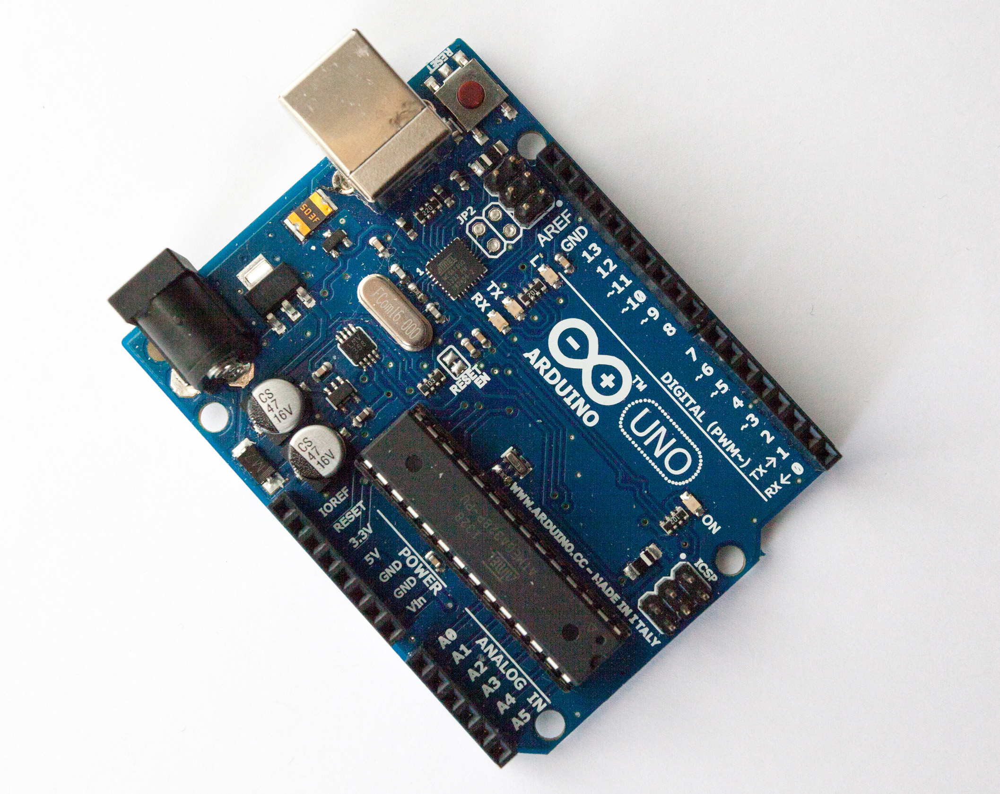
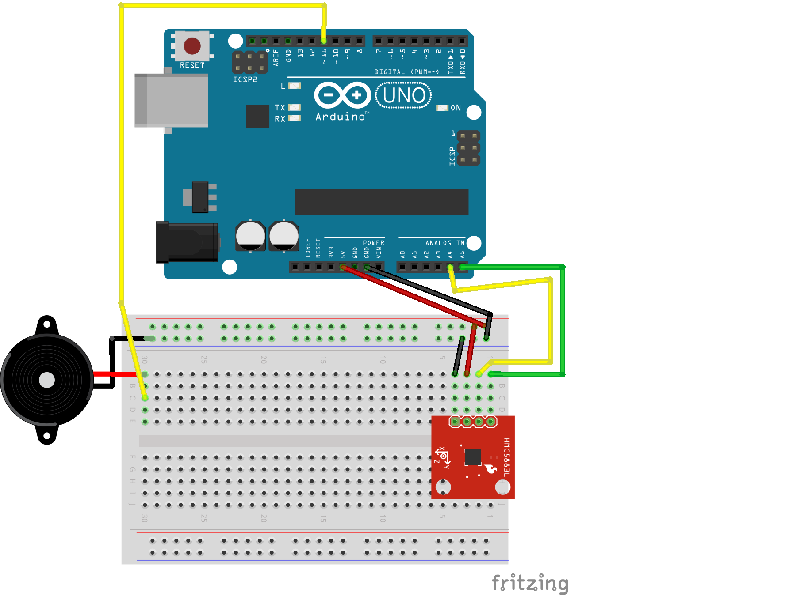

2016 is my own year of combining JavaScript with hardware in the real world, including a large project that I'm almost ready to talk about, but not quite. When I talk to web developers about hacking on hardware, often the first question I hear is: _but how does it_ work? _How do JavaScript and hardware work together?_

## What is _hardware_?

There are several technical ways JavaScript can be used to control physical objects. Most of the _objects_ I'm talking about loosely here can be categorized as _embedded systems_. _Embedded system_ is a term that sounds a bit more complex than it need be—in (blog-post-informal) essence they're _embedded_ because they tend to be hidden away inside of something, like a thermostat or a microwave or a homebrew 3D-printed project enclosure; _systems_ because they combine a tiny computer with various connections and power to create, well, a _system_.

The "tiny computer" involved is typically a _microcontroller_, which combine processor, memory and I/O capabilities are combined in a single package (that is, a chip). Microcontrollers tend to be simple creatures, 8- or 16-bit processors with limited memory (on the order of tens of kilobytes, often) that require very little power to do their thing. They're cheap, reliable and ubiquitous.

Microcontrollers are small, with absolutely itty-bitty connection pins. For novices and hackers and prototypers, _development boards_ make it easier to work with microcontrollers by providing human-sized ways to connect to the I/O pins of the microcontroller. The boards also provide a steady way to power the microcontroller as well as several supporting features like timing chips, connections for different communication protocols, easier methods to get programs onto the microcontroller, etc.

Developer boards like the omnipresent Arduino Uno give easy access to I/O connections and take some headache out of working with microcontrollers.

## Controlling constrained hardware with JS

Microcontrollers are getting cheaper and faster. Newer, 32-bit MCUs (that's an abbreviation for _microcontroller_), especially some of the ARM Cortex-based ones, are capable of running actual native JavaScript, or something damn close to it. It has become feasible to run _embedded JavaScript_. But we'll put that aside for another time.

Aside from embedded JavaScript, another method for controlling hardware with JavaScript is a _host-client_ setup. Recall that microcontrollers can be quite constrained—8- or 16- bit processors, very limited space for programs. They're not up to running an operating system or Node.js or executing JavaScript on their own. Instead, the host-client configuration converts the hardware (microcontroller-based board) into a _client_ which does the bidding of JavaScript that is executed on a _host_ (e.g. your laptop).

A combination that works consistently for me is uploading (flashing) the firmata protocol to an Arduino-compatible board—this might sound mysterious but is as easy as uploading a pre-packaged script to the board from the free and cross-platform Arduino IDE. Then I write scripts using [`Johnny-five`](http://johnny-five.io) and execute them with `node`.

Johnny-five provides a high-level API (with classes like `Led`, `Compass`, `Piezo`, etc.) that can feel more comfortable to higher-level programmers than microcontroller code written in C or whatnot. Getting started is pretty easy!

## Learning about Johnny-Five

I recently gave a presentation about this at the [March meeting](http://www.meetup.com/JavaScript-and-the-Internet-of-Things/events/228638637/) of Portland's [JavaScript on Things](http://www.meetup.com/JavaScript-and-the-Internet-of-Things/) Meetup.

To learn more about how prepare a board as a client and some Johnny-five basics, you can read [my (warning: pretty informal!) slides](http://lyzadanger.github.io/jsot-johnny-five-slides). Or jump straight to looking at [some examples of scripts and wiring schematics](https://github.com/lyzadanger/jsot-johnny-five), like this "pointing-north alarm":

I was also just on [Hanselminutes](http://www.hanselminutes.com/521/march-is-for-makers-arduinos-javascript-and-johnny-five-with-lyza-danger-gardner) talking about the host-client method of controlling hardware with JavaScript.
