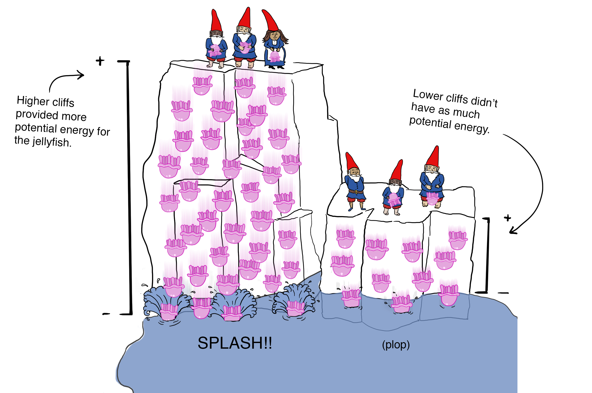

<a href="https://www.manning.com/books/javascript-on-things"></a>

_The following is an excerpt from chapter 3 of_ [JavaScript on Things: Hardware for Web Developers](https://www.manning.com/books/javascript-on-things) _by me, Lyza Danger Gardner. I hope you enjoy it! The book is in early release (MEAP) from Manning Publications._

---

Designing and building circuits may be completely new to you, and may seem intimidating. The good news is that there are just a handful of core concepts to wrap your head around. Once you understand the interplay of voltage, current and resistance—as formalized in Ohm's Law—you're well on your way to being able to understand basic circuits.

There are a couple of metaphors traditionally used to illustrate voltage, current and resistance. The most common analogy is a hydraulic (water) system involving tanks and pipes. Effective, but not always memorable. Let's try a different adventure.

## Voltage, Current and Resistance

High in the mountains, deep in the forest of some place that does not exist, a tribe of gnomes found themselves inexplicably in possession of an infinite supply of jellyfish. And the gnomes being ornery and mischievous, they struck out to find a humorous use for the otherwise-inert creatures. They found great fun in dropping jellyfish over cliffs, watching them splash into the lake below or bounce off the roofs of local villages.

The nearby townspeople were initially inconvenienced but soon recognized that the plummeting invertebrates carried energy and could be a free source of power for their cookie factories—but only if the onslaught could be harnessed safely. So they observed, and, over time, came to understand and manipulate the core factors of electrical circuits: voltage, current and resistance.

Townspeople noticed quickly, for example, that the higher and steeper the cliff, the more energy tossed jellyfish have when they reach the lake on the valley floor. Lesser drop-offs don't provide as much potential energy for hijinks when the jellyfish splash down.

Higher cliffs provide more "voltage", that is, electrical potential. *Voltage* is like electrical "pressure", pushing the charges (jellyfish) from high potential energy toward a location of lower potential.



_Voltage_ is a measurement of the difference of potential energy between two points. It's something like pressure or tension or gravitational force, as electricity is always itching to move from higher voltage to lower voltage. Voltage, measured in volts, is _potential_ energy, however—voltage alone without moving charged electrons (jellyfish) can't wreak any havoc.


For something interesting to happen, jellyfish need to get actively chucked over the edge of the cliff, a task which the gnomes are more than happy to perform.

The townspeople learned to measure jellyfish current by staking out a spot on the cliff and precisely counting the number of jellyfish that passed by over a precise period of time. _Current_, the flow of electric charge, is measured in _Amperes_, often abbreviated as _Amps_.


*Current*, the flow of electricity, can be measured by counting how many charges (jellyfish) pass a specific spot on a cliff during a defined period of time.

The townspeople needed to find a way to manage the current of jellyfish so that it wouldn't overwhelm the delicate cookie presses and ovens. This is the lynchpin of jellyfish circuit control: _resistance_. Resistance is how much a material is able to resist electrical flow. It is measured in _Ohms_.

They engineered jellyfish-channeling systems into the cliff faces, restricting their flow to a more reasonable level. For circuits near the higher cliffs (more voltage), these systems had to be more robust because of the immense jellyfish-falling pressure from above.

Townspeople add *resistance* to the circuit by channeling falling jellyfish through a series of tubes. Increasing resistance lowers the current.


A summary of the townspeople's discoveries is shown here:

**Voltage**

* What it means: The difference of electrical potential between two points. Akin to electrical "pressure". It's what pushes electrical charges through a circuit.
* Abbreviated as: V (occasionally E)
* Measured in units of: Volts

**Current**

* What it means: how many electrical charges are passing a single point during a defined period of time.
* Abbreviated as: I
* Measured in units of: Amperes (Amps)

**Resistance**

* What it means: A measurement of a material's ability to resist electrical flow.
* Abbreviated as: R
* Measured in units of: Ohms (denoted by the Ω symbol)

In the end, the townspeople perfected the circuit and the jellyfish helped to make some of the best cookies around.

There is a power source—troops of gnomes—tossing jellyfish over a cliff. The higher the cliff, the more *voltage* (potential energy) is supplied to the circuit. The *current* (flow) of jellyfish heads toward the factory machinery.

To reduce the jellyfish current to manageable levels, channeling systems and pipes add *resistance*.

Once the jellyfish have given power to the cookie-making machinery and reached the floor of the factory, they reach the point of lowest potential in the circuit. Jet-pack-wearing gnomes act like a pump of sorts, hoisting the weary jellyfish back up the cliff where they can be thrown over again. And again and again...


Voltage, current and resistance are vital concepts of basic circuitry. The next step is to understand how these factors relate to each other, and how they apply to real-world circuits.

### Ohm's Law

Voltage, current and resistance are related to each other in consistent ways. Each of the three factors is like a lever: tweak one and you will affect the others. These interplays became so central to the town's populace that the factories started producing cookies that illustrated the relationships.

The townspeople's new signature cookie showed the relationship between voltage (V), current (I) and resistance (R).


The bearer of the cookie can bite off the factor she wishes to determine—then see how it can be derived from the other two factors. For example, if she wanted to determine resistance (R), she could bite that off and see that R = voltage (V) divided by current (I).


Georg Ohm figured out these key relationships between voltage, resistance and current back in the 1820s, well before the clever cookie-townspeople, which is why _Ohm's Law_ bears his name. If you prefer your math in non-cookie form, the relevant equations are:

```
V = I x R (Voltage equals current times resistance)
I = V / R (Current equals voltage divided by resistance)
R = V / I (Resistance equals voltage divided by current)
```

---

_OK_, you might be thinking, _but how do I apply this in the real world?_ ... Well, I hope you might give [_JavaScript on Things: Hardware for Web Developers_](https://www.manning.com/books/javascript-on-things) a read and find out!
