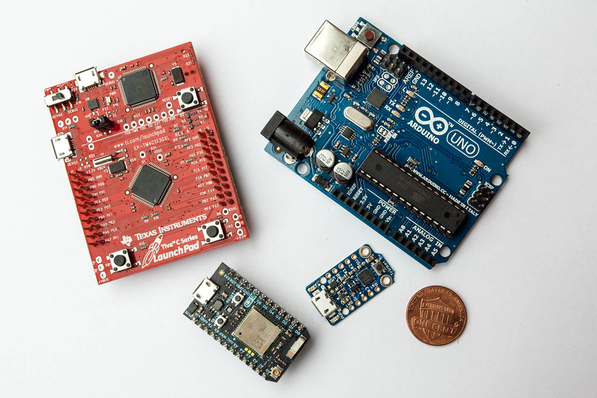
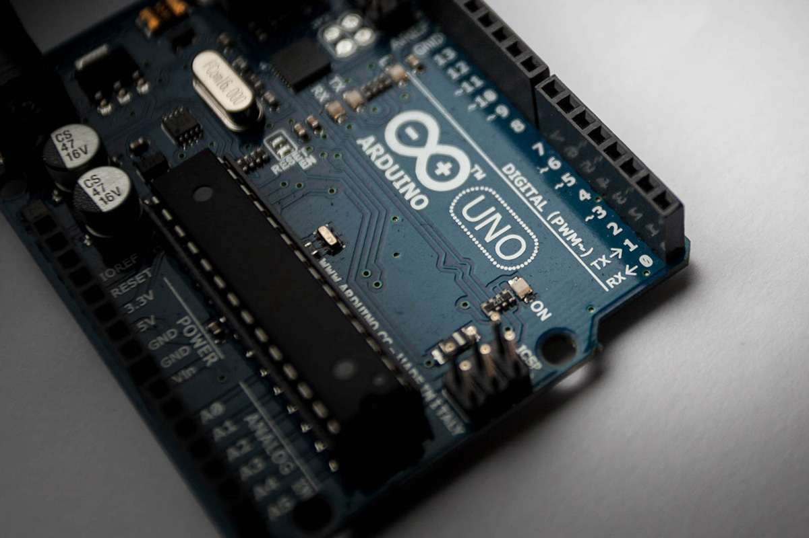
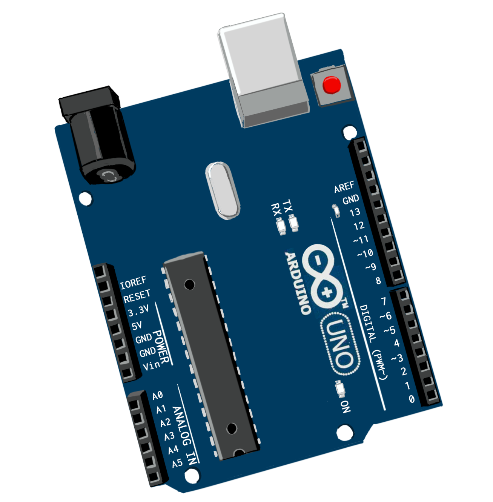
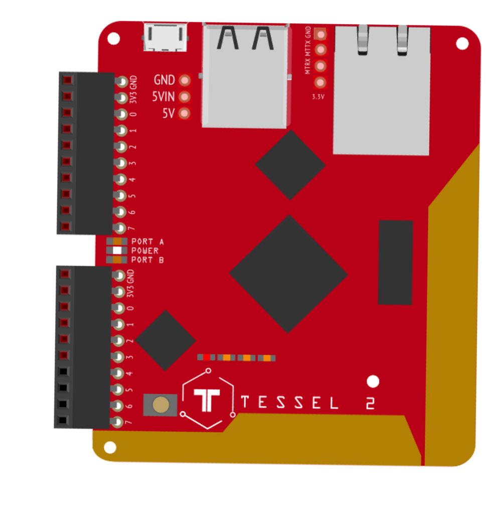

_As part and parcel of writing my book_ ([JavaScript on Things, Manning](https://www.manning.com/books/javascript-on-things) ) _and scratching the curiosity-itches of my hardware-hacking hobbies, I’ve had my hands on scads of different hardware platforms and components over the past year and more. This series of articles contain a collection of opinions and recommendations based on my experiences as they relate to two focus areas: electronics for beginners and JavaScript-controlled hardware._

This post’s electronics experience rating: ABSOLUTE BEGINNER

----

A question I field often is: “What kind of board should I buy to learn how to do this stuff? Where do I start, hardware-wise?” And there are two boards I tend to recommend, in the end—which is why they figure so prominently in [my book](https://www.manning.com/books/javascript-on-things) (Don’t worry, I’ve provided some other educational links for each in case my shameless plug is…shameless).

## What’s a Development Board?
Let’s not go off half-cocked with a major undefined or vague term. What’s a development board, anyway? In my book I use the following definition:

> _Development boards_, also called _prototyping boards_ or just _boards_, are physical development platforms that combine a microcontroller or other processing component with useful supporting features. They are the bread and butter of the hardware-hacking lifestyle. Boards range in cost from just a few bucks to over $100 for high-end [Single-Board Computers, a.k.a.] SBCs.
>
> Boards are centered around their brain, a combination of processor, memory and I/O. 8- or 16-bit microcontrollers are at the center of  straightforward, entry-level prototyping boards like (most) Arduinos. Boards with more sophisticated, 32-bit microcontrollers may be able to run embedded JavaScript.

When setting off on a learn-electronics journey, choosing a board is a solid first step. It’ll determine the trajectory of your explorations.

_Photo: A selection of development boards. Clockwise from top left: Texas Instruments Launch Pad, Arduino Uno R3, Adafruit Trinket 5V, Particle Photon_

## Ideal Things for a Beginner
Features that make a development board ideal for beginners include clarity, constraints and ubiquity. Put another way, good dev boards for n00bs have simple, obvious features and are used by a whole crapload of folks.

### Clear, Intuitive Features

A good beginner dev board should support a reasonable set of I/O features (note: this is usually dictated by what features the board’s microcontroller can support). Different _pins_ on the board support different features, which should include—at the least—digital I/O, analog input, PWM (pulse-width modulation), ADC (analog-to-digital conversion) and serial support (including I2C and SPI). Don’t worry a tick if you haven’t heard of any or all of those things yet.

Pins should be sensibly laid out and named (or, often, numbered). Many boards have pin numbering and capability information helpfully _silkscreened_ onto the board itself. A board with missing key features, nonsensical pin layout or a confusing pinout diagram can make you wish you hadn’t bothered.

_Photo: Detail of the Arduino Uno (R3) board showing silkscreened pin numbers._

### Constraints

The more things you can do with a dev board, the more distracted you can get. While a juiced-up microcontroller, or more flash memory for your programs, or additional peripherals and goodies sound tempting, they’re also potentially pits to wallow in and get overwhelmed.

Limits to the oomph of your first dev board can paradoxically be freeing, allowing you to zero in on the fundamentals of electronics hackery without suffering from the angst of overchoice.

For example, despite their popularity, I’d recommend against the Raspberry Pi family for introductory electronics explorations.  _So much_ is possible with the Pi platform that it can be distracting and overwhelming if you want to focus on electronics fundamentals for a bit.

Also, Pis fall short in feature complement: while they certainly have some on-board I/O capabilities, their convoluted pin numbering, limited PWM (pulse-width modulation) support and complete lack of ADC (analog-to-digital conversion) makes introductory I/O hackery potentially confusing and frustrating.

An aside, though: If you want to tinker around with projects that make use of the Pi’s general-computing powers—for example, cobbling together a tablet-like PC for your kitchen—by all means, do! They are fantastic tiny computers, just not the most ideal beginner electronics platforms.The newer [Pi 3](https://www.raspberrypi.org/products/raspberry-pi-3-model-b/) is especially fantastic, by the way.

### Ubiquity

When you’re choosing your first dev board, you’re focused on learning how to do things with electronics. Getting sidetracked by a platform’s idiosyncrasies (or, even, bugs) is not only annoying, it can be derailing. At this point in your journey, it shouldn’t be your job to figure out whether a component or project is misbehaving because of some arcane wonkiness in the hardware (or supporting firmware) itself. Working on a well-tested platform is helpful here: when an LED fails to blink, it’s more than likely pilot error; you can factor out most (but never all, truth be told) random flakiness when trying to figure out what’s up.

And when you do get stuck or confused, it’s awfully nice to have a big corpus of support to turn to.

For both of these—stability and support—an underlying core factor is the platform’s popularity, its relative ubiquity. For beginners, choosing a platform that is widely used and has been around for a while can be a sanity-saving tactic.

## Two Different Approaches
At the end of the day, there are certain dev boards that tick most of the boxes time and time again, for each of two approaches (and you choose your own adventure here!):

* *Learning key electronic fundamentals*: In this path, you’re really focused on understanding electronic principles on a fundamental level. This is for you if you’re innately curious about the interactions of current, resistance and voltage (howdy, Ohm’s Law!) and, really, how things _work_ physically. This path is lower-level but leads to a wide competence in low-voltage DC circuitry (believe me, this really does come in handy in life!).
* *Building web-connected devices*: This is for you if you have at least a passing interest in the electronics themselves (if you don’t, this post really isn’t for you, anyway), but also have some (software) development background (read: JavaScript). This approach gets you to fully-flung embedded systems faster, in some cases making the vast `npm` ecosystem of Node.js available to you. This will require a more sophisticated microcontroller/processor than those needed for the first path.

## First Choice for Learning Electronics Fundamentals: Arduino Uno R3
Ohmigod, how _boring_! you might be lamenting. I’ve just held up the non-cutting-edgiest, pedestrian, and basically _first_ open-source board as a shining example of newbie awesome.

_Illustration: A bad artist's impression of the Arduino Uno (R3) board_.

Yes, it’s true, the Uno has been around since a long time, and, also true, is seriously _not flashy_, but it really is a platform of the people. Its relative stodginess is a blessing when compared to the immaturity and fragility of many boards. Sure, working with one won’t give you the smug _frisson_ of novelty, but it will, in most cases, _actually work_. The Uno does what it says it does. If it didn’t, there are a lot of people who’d be irked.

Statistics are spotty at best, but even back in 2013, 700,000 _official_ Arduino boards had been “registered”, with an estimated 700,000 additional “derivative or clone board[s]”, that is, about a one-to-one ratio ([source](http://medea.mah.se/2013/04/arduino-faq/)).

Let’s talk about a couple of things here. First: Arduino is a _family_ of boards, and the 700k number references Arduino boards of all stripes, not specifically the Uno (though the Uno is the most popular, and, no, I don’t have a good source for that but it _certainly seems to be the damned case_). At the same time, it’s been several years so surely there are many more. All right, that’s out of the way.

The “derivative or clone board” notion arises because while Arduino is open-source, “official” ones carry the Arduino logo and can only be made by certain blessed manufacturers. Non-official ones are fine, too, but there is a bit of a thing with knock-offs that have the logo but shouldn’t, so-called [“counterfeit” Arduinos](https://www.arduino.cc/en/Products/Counterfeit), which are cheaper to buy but potentially shoddy.

Here’s how the Arduino Uno R3 stacks up:

* *Clear, Intuitive Features*: Unos have clearly-marked I/O pins, laid out sensibly. An added bonus: pins that support PWM are marked with a tilde (~) and, once again, don’t worry if you don’t know what that is, yet. While Unos certainly aren’t the most svelte form factor, their roominess gives you plenty of space to maneuver. Unos, or, more accurately, their ATmega328P microcontrollers, support all the requisite basic features just fine.
* *Constraints*: That selfsame ATmega328P microcontroller is 8-bit, running at something like 20MHz, and it only has 32kB of Flash memory (space for your programs). That’s _really_ constrained. You’re not going to run any kind of (recognizable, let’s not get clever here) OS on that, that’s for sure. But it totally fits the bill for doing all the classic things you do when learning embedded electronics.
* *Ubiquity*: It doesn’t get more ubiquitous. Also, the ATmega328P is a battle-tested microcontroller; it’s reliable and sensible.

Expect to pay about US$25 for a certified Arduino Uno R3, considerably cheaper if you’re willing to take a risk on reliability, which, at this stage in the game, I wouldn’t?

The Uno: unglamorous, reliable, and the _sui generis_ for educational hardware hacking. There is really no substitute.

### Learning Electronics with the Arduino Uno

OK, so there is this fantastic book—brilliant visual design, clear instructions, just in all ways excellent. It’s called _Arduino Projects Book_. But there’s a pretty major downside: you can _only_ get it if you purchase the (official) [Arduino Starter Kit](https://store.arduino.cc/usa/arduino-starter-kit). That’s a bit of a bummer, but I will say: that starter kit rocks. It’s worth getting if you can spare the extra funds (they’re currently retailing at $85). Of course, there are tons of other getting-started books on the market if you Google around a bit.

[LadyAda’s tutorials](http://www.ladyada.net/learn/arduino/) are a free resource, and there are a [handful of books for beginners](https://store.arduino.cc/usa/books-manuals) called out on the Arduino website.

## First Choice for Web-Connected Devices: Tessel 2

And now for something completely different, and lightly violating what I said about constraints and ubiquity: the [Tessel 2](https://tessel.io/) board. The Tessel runs an optimized-for-embedded Linux distribution, OpenWRT, and has enough oomph to run Node.js on-board. So, if you’ve selected the “Web-Connected Devices” adventure, you can `npm` to your heart’s content and do some pretty complex, nifty software things in short order.

Like the Arduino, Tessel is an open-source platform. Also like the Arduino Uno, the Tessel’s pins are sanely organized and labeled and the board supports all the major features you’d expect. It’s a more sophisticated device than the Uno, with a separate co-processor for handling I/O. There are some frills. You’ll likely put the on-board WiFi to use straightaway. There are two USB peripheral ports, which are fun to play with but I’d recommend keeping it simple to start and ignoring those initially.

For controlling the Tessel 2, I recommend Johnny-Five, an open-source, widely used, cross-platform-compatible JavaScript framework.

Here’s how the Tessel 2 Stacks Up:

* *Clear, Intuitive Features*: Tessel 2’s pins are organized into two “ports” of 10 pins each (two power pins and 8 I/O). They’re straightforward to figure out. The workflow will feel familiar to web and Node.js developers. The on-board WiFi is a real boon for building web-connected things.
* *Constraints*: The Tessel can do more stuff than the Uno and that’s potentially overwhelming, but if you resist the temptation to futz around with interesting features of its OpenWRT OS and the USB peripherals right away, it can provide a focused learning platform, especially paired with Johnny-Five.
* *Ubiquity*: Straight up, the Tessel 2 doesn’t have a massive user base. But it’s growing into itself and maturing. Johnny-Five recently had its fifth birthday, and has a wide community of contributors and supporters.

A lot of bells and whistles don’t necessarily make this a complicated platform. The workflow is smooth and feels natural for Node.js/JavaScript programmers. Johnny-Five has intuitive, built-in support for tons of components.

### Learning Electronics with the Tessel 2

SparkFun sells a complete [Johnny-Five Inventor’s Kit](https://www.sparkfun.com/products/13847), which includes a Tessel and a bunch of components (disclaimer: I was involved in writing the [experiment guide](https://learn.sparkfun.com/tutorials/experiment-guide-for-the-johnny-five-inventors-kit). Even if you don’t buy the kit, that guide is pretty exhaustive (tons of great effort from several committed people!).
