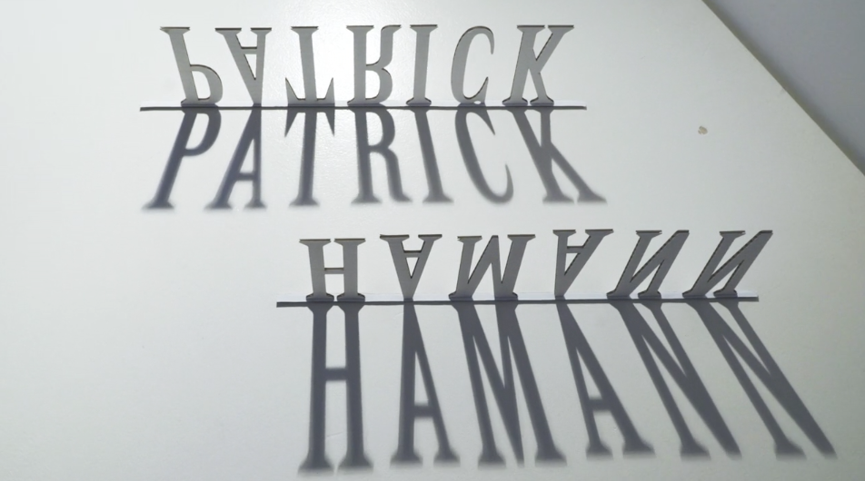
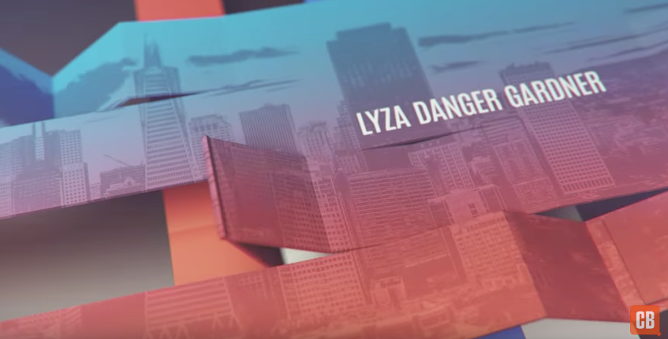

From time to time, we celebrate certain conference videos—usually the kind that show a speaker and some slides in a humorous or educational harmony. But I've also started noticing how high quality some of the intra-conference production can be, like the short video intros that are played between sessions. I'd like to share two from the past year that I thought were too good to be relegated to the cobwebby annals of forgotten conference collateral.

## Smashing Conf NYC 2017

In Marc Costa's [intro video for Smashing Conf NYC 2017](https://vimeo.com/220945744), different materials are laser-cut, twisted, bounced and folded into representations of speaker names, making strong use of the third dimension. It's an artful melding of the technical and the tangible. While each individual composition is handsome, it's the entire collection together that feels sublime.

_A still from Marc Costa's Smashing Conf 2017 intro video. [Watch it on Vimeo](https://vimeo.com/220945744)_

## Generate Conf 2016, SFO

[CreativeBloq's intro video for it's 2016 San Francisco Generate conference](https://www.youtube.com/watch?v=MsTbwflWXKI) is all digital, but the animation is inventive, dimensional and kinetic. And I happen to be a fan of the energy of the music.

_It is awfully fun watching my own name unfurl! [Watch it on YouTube](https://www.youtube.com/watch?v=MsTbwflWXKI)_
